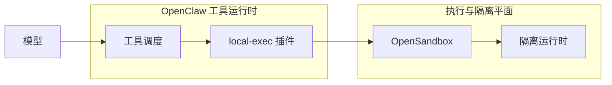
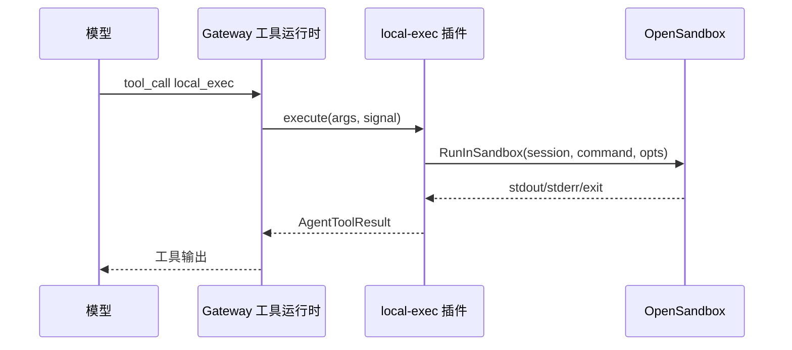

# 以 local-exec 替代 exec 作为工具执行插件的设计

本文档描述一种架构方向：**智能体侧暴露的执行类工具以「local-exec」插件（工具 `name` 建议为 `local_exec`）为主路径**，工具运行时不再直接依赖内置 `exec` 的默认执行链路，而是**经该插件转发至 OpenSandbox，在其中完成命令与（可选）工作区操作**，从而在网关进程外或统一抽象层内完成沙箱化执行。

> **说明**：当前 OpenClaw 主仓中，内置 `exec` 与 `agents.defaults.sandbox` 所解析的 **Sandbox Backend**（如 `docker` / `ssh` / 插件注册的 `openshell`）已在 `createOpenClawCodingTools` 与 `createExecTool` 中贯通。本文中的 **local-exec 工具插件** 与 **OpenSandbox** 按产品/子仓既定方案书写为**执行与沙箱的承载组件**；若实现细节与命名有出入，以对应仓库 API 为准，本文聚焦**边界契约与迁移步骤**。

---

## 参考配置：`openclaw.json` 中以 local-exec 替代 exec

以下片段与通过 `cat ~/.openclaw/openclaw.json` 查看的实际配置一致（仅保留与「关掉内置 `exec` + 打开本插件」相关的字段；其他已安装的渠道类插件条目已省略，部署时可保留）。

**从现网配置摘录的要点**：

- `tools.deny` 中包含 `"exec"`，禁用核心 `exec` 工具，由本插件承接执行类需求。
- `plugins.entries["local-exec"]`：`enabled: true`；`config.sandboxEnabled: true` 时，Python 脚本经 Docker/OpenSandbox 镜像执行（参见 `extensions/local-exec/openclaw.plugin.json` 的 `configSchema` 与实现）。

**可合并进主配置的最小 JSON 示例**（在现有 JSON 上按需合并 `tools` / `plugins` 对象，勿重复顶层键）：

```json
{
  "tools": {
    "deny": ["exec"]
  },
  "plugins": {
    "entries": {
      "local-exec": {
        "enabled": true,
        "config": {
          "sandboxEnabled": true,
          "sandboxImage": "local/python-execd"
        }
      }
    }
  }
}
```

**与策略、工具名的对齐**：

1. `plugins.entries` 下的键名必须与插件 manifest 的 **`id` 一致**：本仓为 **`local-exec`**（见 `extensions/local-exec/openclaw.plugin.json`）。
2. 本插件注册的 Agent 工具 **`name` 为 `local-exec`**（见 `extensions/local-exec/src/tool.ts`）。若使用显式 `tools.allow` 或沙箱子策略中的按名放行，请把 **`local-exec`** 加入允许列表，否则插件工具会被过滤。
3. `sandboxImage` 可省略时使用 schema 默认值 `local/python-execd`。
4. 上图配置仅 `deny: ["exec"]`；若仍依赖核心 **`process`** 等后台工具，请不要把 `"process"` 加进 `deny`，除非已确认替代方案。

---

## 1. 背景

### 1.1 现状（OpenClaw 核心）

- **执行工具**：核心提供名为 `exec` 的工具（及配套的 `process` 等），在网关进程内解析 `host`（`auto` 时按会话是否已有沙箱运行时等在 `sandbox` / `gateway` / `node` 间解析，见 `docs/tools/exec.md`）、审批策略、PTY、后台会话等，并通过 `runExecProcess` 等路径落地执行。
- **沙箱位置**：当会话处于沙箱模式且 `host` 选择允许在沙箱中执行时，`exec` 使用会话解析得到的 `SandboxContext`，将 `buildExecSpec` / `finalizeExec` 等绑定到 **`SandboxBackendHandle`**，从而由已注册的沙箱后端（Docker、SSH、或插件注册的 OpenShell 等）生成实际执行命令。
- **插件工具**：其他能力可通过 `resolvePluginTools` 注入；工具名与核心工具冲突时会被拒绝或阻断，因此「替代 `exec`」通常意味着**从工具列表中移除或禁用核心 `exec`，并注册同名或不同名但语义覆盖的插件工具**（需明确产品策略：同名替换 vs `local_exec` 新名 + 提示词迁移）。

### 1.2 动机（引入 local-exec + OpenSandbox）

- **职责分离**：希望「是否进沙箱、如何进沙箱、资源配额、审计日志」由 **OpenSandbox** 统一实现，网关只负责会话、模型与工具编排，降低核心代码与具体隔离技术（容器、轻量 VM、远端运行时）的耦合。
- **执行路径插件化**：**local-exec** 作为**工具插件**，可在独立发布周期内演进（协议、凭据、可观测性），而不必每次修改核心 `bash-tools.exec`。
- **与现有 OpenSandbox 能力对齐**：你方已明确 **local-exec 工具插件当前通过 OpenSandbox 实现沙箱**；本设计将其正式化为**推荐执行平面**，并定义与 OpenClaw 配置、工具策略、进程/PTY 语义的对齐方式。

---

## 2. 目的

| 目标 | 说明 |
|------|------|
| **统一沙箱入口** | 模型可调用的「执行」能力默认走 **local-exec → OpenSandbox**，避免双轨（核心 sandbox backend 与 OpenSandbox）长期并存且无文档边界。 |
| **可替换核心 exec** | 在受控部署中，可通过工具策略禁用核心 `exec`/`process`（或等价限制），仅暴露 **local-exec**，使攻击面与运维模型与插件版本绑定。 |
| **契约稳定** | 定义 local-exec 与网关之间的**参数子集、错误码、超时、流式输出/后台**行为，便于多语言实现与回归测试。 |
| **可观测与合规** | 执行请求带 **sessionKey / agentId / runId** 等关联 ID，由 OpenSandbox 侧落审计日志；网关侧保留工具调用记录。 |

非目标（建议显式排除，避免范围膨胀）：

- 不要求 OpenSandbox 一次性替代 **文件类工具**（`read` / `write` / `edit`）的 FS Bridge；可分期：第一期仅 shell，第二期再通过 OpenSandbox 挂载或同步工作区。
- 不要求废弃 OpenClaw 内置 **Sandbox Backend** 注册机制；可并存，由配置选择「会话沙箱是否仍由核心后端持有，仅 exec 外迁」或「会话级沙箱完全由 OpenSandbox 表达」。

---

## 3. 用例视图

### 3.1 参与者

- **操作者 / 模型**：发起工具调用（自然语言驱动下的 `local-exec` 或同名工具）。
- **OpenClaw Gateway / 工具运行时**：解析配置、工具策略、会话上下文，将工具分发给对应 `execute` 实现。
- **local-exec 插件**：校验参数、组装 OpenSandbox 请求、处理流式/异步结果、映射错误。
- **OpenSandbox**：创建/复用隔离环境、执行命令、实施网络/文件策略、回收资源。
- **运维 / 安全**：配置插件、OpenSandbox 策略、密钥与配额。

### 3.2 用例列表（摘要）

| ID | 用例 | 主成功场景 | 失败/边界 |
|----|------|------------|-----------|
| UC-01 | 前台执行单行命令 | 模型传入 `command`，在会话工作目录执行，返回 stdout/stderr/exitCode | 超时、命令被拒绝、沙箱配额满 |
| UC-02 | 指定工作目录与环境变量 | `workdir` / `env` 传入后经 OpenSandbox 校验路径与 allowlist | 路径逃逸、非法 env 键 |
| UC-03 | PTY 交互类命令 | `pty=true` 时分配伪终端（若 OpenSandbox 支持） | 不支持时降级或明确错误 |
| UC-04 | 后台与续查 | 与现有 `process` 语义对齐或文档化差异：返回 sessionId，后续通过插件提供的查询工具或同一工具的子操作续查 | 会话隔离、跨 agent 不可见 |
| UC-05 | 禁用核心 exec | 工具策略 `deny: ["exec", "process"]` 且 allow 插件工具的实际 `name`（常见为 `local_exec` 等标识符，与产品名「local-exec」不必相同） | 模型仍尝试调用 `exec` → 被策略拒绝 |
| UC-06 | 与 elevated / gateway 执行的关系 | 明确 **local-exec 是否允许「非沙箱」执行**；若允许，需与 `tools.elevated` 及审批文件策略统一或显式禁止 | 双路径绕过沙箱 |

### 3.3 用例图（逻辑视图）



### 3.4 序列图（单次前台执行）



---

## 4. 实现方案

### 4.1 总体架构

推荐采用 **「插件工具 + OpenSandbox 服务」** 两层结构：

1. **local-exec 插件**（运行在 Gateway 进程内）：实现 OpenClaw 插件契约（`register` / `tools` factory），暴露工具的 **`name` 字段**需与 `tools.allow`/`deny` 一致（建议 `local_exec`，避免与 URL/CLI 中的连字符混淆；对外文档仍可使用「local-exec」）。`execute` 内只调用 **OpenSandbox 客户端**（HTTP/gRPC/CLI/本地 SDK，以实际为准）。
2. **OpenSandbox**：负责沙箱生命周期、实际 `fork/exec` 或容器内执行、 cgroup/网络策略等；对 local-exec 提供稳定 API。

与核心 **Sandbox Backend** 的关系可选两种模式（部署时二选一或分阶段）：

| 模式 | 描述 | 适用 |
|------|------|------|
| **A. 仅外迁 exec** | 会话仍可解析 `SandboxContext`，但核心 `exec` 从工具列表移除；文件工具仍用核心 `SandboxFsBridge`。OpenSandbox 仅服务 local-exec。 | 快速落地，文件路径与现有一致 |
| **B. 会话级统一** | 会话的「是否在沙箱」由 OpenSandbox 持有；核心 `agents.defaults.sandbox.mode` 与后端对该会话弱化或关闭，避免重复隔离。 | 长期简化心智 |

### 4.2 工具面：如何「替代 exec」

1. **工具策略**  
   - 在 `tools.*` / `tools.sandbox.tools.*` / agent 级策略中 **deny** `exec`（及如需禁用的 `process`）。  
   - **allow** 插件注册的工具名（例如 `local_exec`）。  
   - 在系统提示词或工具描述中引导模型使用新工具名（若未使用同名插件替换）。

2. **同名替换的可行性**  
   - OpenClaw 插件注册时会检测 **plugin id 与核心工具名冲突**；若插件以 `exec` 为 plugin id 通常会失败。  
   - **可行做法**：核心提供配置项 **`tools.exec.provider: "core" | "plugin:<id>"`**（或等价开关）由核心在构造 `createOpenClawCodingTools` 时**不注册**内置 `createExecTool`，改由指定插件提供 `exec` 名称的工具。此为**核心小改动**路径，需在实现阶段开 issue 评审。  
   - **零核心改动路径**：插件工具名为 `local_exec` / `local-exec`，依赖策略与文档迁移。

3. **参数与语义对齐**  
   - 建议以现有 `exec` 文档（`command`, `workdir`, `env`, `timeout`, `pty`, `background`, `yieldMs` 等）为 **参考子集**，在 local-exec 文档中标注 **支持 / 不支持 / 行为差异**，减少模型与存量自动化迁移成本。

### 4.3 local-exec 与 OpenSandbox 的契约（建议最小字段）

插件 → OpenSandbox 请求建议携带：

- **身份与关联**：`sessionKey`, `agentId`, `runId`（若有）, `scopeKey`（与现有多会话/后台隔离对齐）。
- **执行**：`command`（或 argv 数组）、`cwd`、`env`、`timeoutSec`、`pty`。
- **策略引用**：OpenSandbox 侧策略 profile 名或版本号（由运维配置），避免在每次请求中放大 env。

响应建议包含：`exitCode`, `stdout`, `stderr`, `durationMs`, `sandboxInstanceId`, `truncated` 标志。

### 4.4 与 `process` / 后台会话

若需与现网 `process` 工具行为一致：

- **方案 1**：local-exec 仅同步；后台由**仍使用核心的 `process` 工具** 管理——则必须保留核心进程监管与 session 关联，与「禁用 exec」目标可能冲突。  
- **方案 2**：OpenSandbox 支持长生命周期进程 + 插件提供 **local-process** 或扩展 local-exec 子命令查询——推荐与 OpenSandbox 团队统一会话模型。  
- **方案 3**：第一期文档声明 **不支持后台**，避免语义分裂。

### 4.5 配置（示意）

以下为**逻辑分组**，具体键名需与 OpenClaw `plugins.entries.*` 及 OpenSandbox 部署方式对齐：

与本仓 manifest 一致、且能通过 `configSchema`（`additionalProperties: false`）校验的插件段见上文 **「参考配置」**。下表为**设计讨论用**的补充占位（尚未进入本插件 `openclaw.plugin.json`，**不要**与 `sandboxEnabled` / `sandboxImage` 混进同一 `config` 对象，否则配置校验会失败）：

```json5
{
  plugins: {
    entries: {
      "local-exec": {
        enabled: true,
        config: {
          sandboxEnabled: true,
          sandboxImage: "local/python-execd",
        },
      },
    },
  },
  tools: {
    deny: ["exec", "process"],
    // allow 若显式列出，需包含工具名 local-exec
  },
}
```

远期「独立 OpenSandbox 控制面」字段（仅示意，供产品化扩展 `configSchema` 时对照）：

```json5
{
  "opensandbox": {
    "endpoint": "https://opensandbox.internal",
    "profile": "default-agent-exec",
    "auth": {}
  },
  "execCompat": {
    "mapLegacyExecNames": false,
    "defaultTimeoutSec": 1800
  }
}
```

若采用 **模式 B（会话级统一）**，需增加对 `agents.defaults.sandbox.mode` 与 OpenSandbox 的互斥或联动说明，并在 `openclaw sandbox explain` 类诊断中显示「执行平面：OpenSandbox」。

### 4.6 安全与审计

- **默认拒绝**：OpenSandbox 默认最小权限网络与文件系统；插件不得将网关主机任意路径未经校验传给 OpenSandbox。  
- **防止双轨绕过**：若同时启用核心沙箱与 OpenSandbox，需明确 **文件工具是否仍在主机可写**；否则模型可能用 `write` 绕过「exec 沙箱」。  
- **密钥**：OpenSandbox 凭据走现有 SecretRef / 环境注入，不进入模型上下文。

### 4.7 测试与发布

- **契约测试**：对 OpenSandbox mock 做 golden 请求/响应。  
- **集成测试**：一轮真实会话：仅 local-exec、禁用 exec，验证构建/测试类工作流。  
- **回滚**：保留配置开关，一键恢复核心 `exec` 与原有 `tools.deny` 空集。

### 4.8 里程碑建议

| 阶段 | 交付 |
|------|------|
| M0 | 本文档评审定稿；确定工具名与是否做核心「exec 提供者」开关 |
| M1 | local-exec 前台执行 + OpenSandbox 最小 API + 工具策略样例 |
| M2 | PTY / 超时 / 输出截断对齐；可观测字段齐全 |
| M3 | 后台与 process 语义（若需要）；与 `openclaw sandbox explain` 诊断联动 |
| M4 | 模式 B 可选；文档与默认配置更新 |

### 4.9 `local_exec` 工具参数契约（建议）

下列字段与内置 `exec` **对齐程度**在实现阶段应用表格「支持 / 部分 / 否」落库到插件 README；此处给出**推荐优先级**。

| 参数 | 必填 | 说明 | 与 `exec` 对齐建议 |
|------|------|------|---------------------|
| `command` | 是 | 在 OpenSandbox 内由 shell 或固定解释器执行的一行或多行命令字符串 | 语义一致；若 OpenSandbox 仅支持 argv 模式，插件内负责安全拆分或拒绝含管道/重定向的复杂串 |
| `workdir` | 否 | 相对工作区或沙箱内绝对路径；缺省为 OpenSandbox 为该会话绑定的默认 cwd | 与 `exec` 的 workdir 解析规则文档对齐，并在插件内二次校验防止 `..` 逃逸 |
| `env` | 否 | 额外环境变量；键级 allowlist 建议在 OpenSandbox 策略中强制执行 | 对齐；禁止覆盖敏感变量名（如 `PATH` 劫持类）的策略应在 OpenSandbox 或插件双侧之一固定 |
| `timeout` | 否 | 秒；上限建议 clamp 到全局配置 | 默认可与 `tools.exec.timeoutSec` 同源读取 |
| `pty` | 否 | 是否申请伪终端 | 不支持时返回明确错误文本，勿静默改 false |
| `background` / `yieldMs` | 否 | 后台语义 | 见 4.4；未实现前应在工具 description 首段声明 **不支持后台** |

**工具返回体（面向模型）**：除 stdout 文本外，`details` 中建议携带 `exitCode`、`durationMs`、`sandboxInstanceId`（若有）、`truncated`（输出是否被截断），便于排障与自动化断言。

### 4.10 OpenSandbox 调用、取消与错误语义

- **传输**：由插件维护到 OpenSandbox 的客户端（连接池、TLS、mTLS）；超时包含排队 + 执行，与 `timeout` 参数关系在文档中写清（例如取 min(用户, 插件硬上限)）。
- **取消**：工具 `execute` 的 `AbortSignal` 应在插件内**转发**为 OpenSandbox 支持的取消操作（HTTP 取消、gRPC cancel、或 kill 信号）；若 OpenSandbox 不支持细粒度取消，应文档化「仅能在边界处中断」。
- **错误分类**（建议统一映射为可读文本 + 稳定 `code` 供日志索引）：

| 类别 | 示例 | 插件行为 |
|------|------|----------|
| 4xx 配置/鉴权 | profile 不存在、token 过期 | 返回明确修复提示；不打满重试 |
| 5xx / 网络 | OpenSandbox 不可用 | 有限次重试 + 退避；超过后失败并记录 `requestId` |
| 业务拒绝 | 配额、策略命中 | 透传 OpenSandbox 消息；不重试 |
| 命令失败 | 非零 exitCode | **视为工具成功返回**（与 `exec` 常见行为一致），在正文或 details 中带 exitCode，便于模型读日志 |

### 4.11 插件工厂可用的 OpenClaw 上下文

插件工具工厂接收 **`OpenClawPluginToolContext`**（见 `src/plugins/types.ts`），其中与 local-exec / OpenSandbox 强相关的字段包括：

- `sessionKey`、`sessionId`、`agentId`：映射到 OpenSandbox 侧隔离键与审计维度。  
- `workspaceDir`、`agentDir`：用于默认 cwd、路径校验与（若需要）工作区种子同步的元数据；**不得**假设 OpenSandbox 与网关共享同一文件系统，除非模式 A 下另有挂载契约。  
- `sandboxed`：表示当前会话在 OpenClaw 语义上是否处于沙箱工具策略；可与 OpenSandbox 策略组合使用（例如 `sandboxed=true` 时强制走更严 profile）。  
- `config` / `runtimeConfig`：读取 `plugins.entries.local_exec` 与全局 `tools.*` 的合并结果。

若需 **runId** 等更细粒度关联，取决于构造工具列表的上层是否在上下文中扩展；当前类型未包含 `runId` 时，可用 `sessionId` + 工具调用 id（若 execute 回调可得）在插件内生成关联键。

### 4.12 与内置 `exec` 行为对照（摘要）

| 维度 | 内置 `exec` | `local_exec` + OpenSandbox |
|------|---------------|------------------------------|
| 执行进程所在主机 | Gateway 或 Docker/SSH 等 **Sandbox Backend** 内 | OpenSandbox 管理的隔离运行时内 |
| `host=gateway` / 审批 | 核心路径 + `exec-approvals` | 默认不提供；若产品需要「沙箱外执行」，须单独设计且防绕过 |
| 与 `process` 联动 | 核心进程监管、同 agent 可见 | 需 OpenSandbox 长进程模型或显式不支持 |
| 可观测 | Gateway 日志 + 现有指标 | 必须增加跨服务 trace id（网关 → OpenSandbox） |

---

## 5. 迁移与运维 Runbook

### 5.1 前置检查

- OpenSandbox 目标环境可连通；profile 已包含 agent 工作区挂载或远程同步策略。  
- 在**预发**会话中同时打开 `exec` 与 `local_exec`，对比同一 `command` 的 exitCode 与输出（允许路径差异，但需可解释）。  
- 确认 `tools.sandbox.tools` 等策略不会误杀 `local_exec`。

### 5.2 切换步骤（建议灰度）

1. **阶段 1**：仅增加 `local_exec`，不禁用 `exec`；观察调用分布与失败率。  
2. **阶段 2**：对选定 agent / 会话在工具策略中 `deny: ["exec"]`，保留 `process` 若仍依赖核心后台。  
3. **阶段 3**：全量 `deny: ["exec","process"]`（仅在 UC-04 已解决前提下）。  
4. **回滚**：移除 deny 或改回允许 `exec`；无需重新发布 Gateway 若配置热加载。

### 5.3 运维面板与告警

- OpenSandbox：队列深度、创建沙箱失败率、p99 执行延迟。  
- 插件：调用次数、按错误码聚合、超时率。  
- 联动：当 OpenSandbox 连续不可用时，可选 **自动降级**（若允许回退到内置 `exec`）必须经安全评审并默认关闭。

---

## 6. 可观测性与 SLO（建议）

- **Tracing**：一次 `local_exec` 调用生成 `trace_id`，经 HTTP/gRPC metadata 传入 OpenSandbox；日志中同时打印 `sessionKey`、`agentId`、`trace_id`。  
- **Metrics**：`local_exec_invocations_total`、`local_exec_duration_seconds`、`local_exec_opensandbox_errors_total{code=}`。  
- **SLO 初值**（可按业务调整）：OpenSandbox 健康时 p99 延迟、可用性 99.9%；插件侧超时率阈值告警。

---

## 7. 待决问题与风险登记

| 编号 | 主题 | 说明 |
|------|------|------|
| Q1 | 工作区一致性 | 模式 A 下 `read`/`write` 与 `local_exec` 所见文件是否为同一树；若否，需在系统提示词中禁止假设「刚写入即可 exec 读到」 |
| Q2 | `runId` 贯通 | 若审计要求 run 级关联，是否扩展 `OpenClawPluginToolContext` 或由网关注入 header |
| Q3 | 多租户 | OpenSandbox profile 与 OpenClaw `agentId` 的映射规则（一对一 / 共享池） |
| Q4 | 许可证与供应链 | OpenSandbox 镜像/依赖的漏洞扫描节奏与 Gateway 发版是否解耦 |
| Q5 | 核心 `tools.exec.provider` | 是否立项实现 4.2 节「同名替换」以降低模型迁移成本 |

---

## 8. 文档自检（多轮审阅记录）

- **一致性**：已区分 OpenClaw 内置 **Sandbox Backend** 与用户所述 **OpenSandbox**；避免混用「沙箱」一词而不指明实现。  
- **可实施性**：指出「同名替换 exec」在现有插件冲突规则下需 **核心小改动或改名** 两条路径。  
- **风险**：强调仅迁 exec 不迁文件工具时的 **绕过面**；建议在用例 UC 中跟踪。  
- **范围**：非目标中写清 FS / 后台的分期策略，避免一期承诺过度。  
- **待与代码对齐**：`local-exec` / OpenSandbox 的实际仓库路径、API 形态、认证方式在定稿前应替换本文中的占位描述。  
- **续写补充**：已增加 4.9–4.12（参数契约、错误语义、插件上下文、`exec` 对照）、§5 迁移 Runbook、§6 可观测与 SLO、§7 待决问题。
